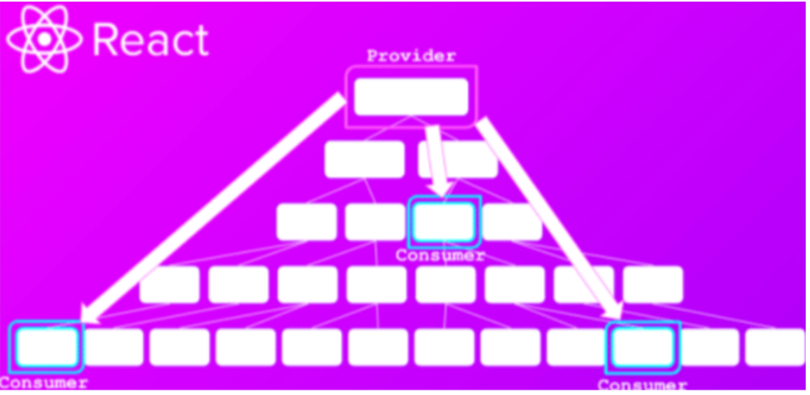

# Estado globales


Para entender los estados globales debemos empezar por recordar los estados locales.

## ¿Qué es un estado en React?

Primero, recordemos lo básico, un **estado en React** es como una **cajita de información** que guarda datos que pueden cambiar mientras el componente vive. Por ejemplo:

```jsx
function Contador() {
  const [cuenta, setCuenta] = useState(0)

  return (
    <div>
      <p>Cuenta: {cuenta}</p>
      <button onClick={() => setCuenta(cuenta + 1)}>Sumar</button>
    </div>
  )
}
```
Aquí `cuenta` es un estado local: solo lo conoce este componente `Contador`.

## ¿Y qué es un estado global?

Un estado global es una cajita compartida que todos los componentes pueden ver y modificar, no importa dónde estén.

### Ejemplo de vida real

Imagina una casa con 5 habitaciones, cada cuarto tiene su luz (estado local), pero todos comparten el WiFi de la casa (estado global).

La luz de cada cuarto no afecta a los demás (es local), pero si el WiFi se apaga, todos los cuartos se quedan sin conexión (es global).

### ¿Por qué necesitamos estados globales en React?

Cuando muchos componentes necesitan compartir o modificar la misma información, un estado local ya no es suficiente.


### Ejemplos reales

- **Un carrito de compras en una tienda:** Todos los componentes (productos, menú, resumen) deben ver el mismo carrito.

- **Un sistema de login:** Si el usuario inicia sesión, todos deben saberlo (Navbar, perfil, etc.).

- **Una lista de tareas como en tu proyecto:** Distintos componentes pueden querer leer o modificar las tareas.

## ¿Cómo se crean los estados globales?

En React hay varias formas, pero la más común sin usar librerías externas es:

1. **Crear un contexto (`createContext`)** Es como crear el WiFi: una red visible para todos.

2. **Usar un `Provider` para compartirlo** Es como prender el router: ahora todos pueden conectarse.

3. **Acceder con `useContext` desde cualquier componente** Es como conectarse desde cualquier habitación.

4. **Controlar los cambios con `useReducer` si el estado es complejo** Así tienes reglas claras para modificar la información compartida.
